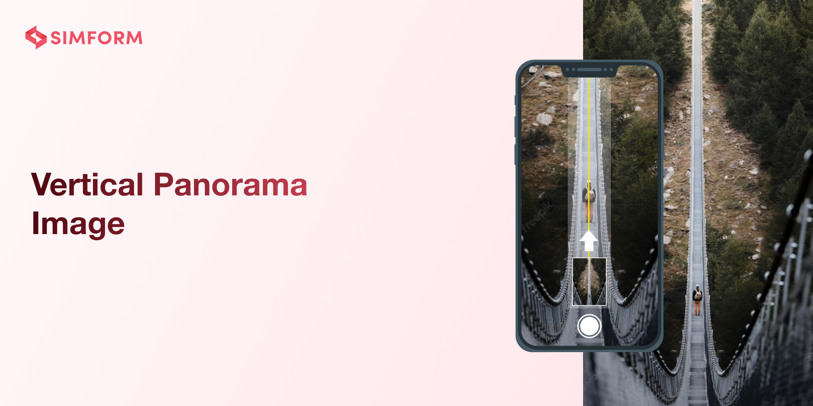

# SSVerticalPanoramaImage
## Capture stunning vertical panorama images with ease and preview them instantly on the built-in screen.
[](https://travis-ci.org/SimformSolutionsPvtLtd/SSVerticalPanoramaImage)
[](https://cocoapods.org/pods/SSVerticalPanoramaImage)
[](https://cocoapods.org/pods/SSVerticalPanoramaImage)
[](https://cocoapods.org/pods/SSVerticalPanoramaImage)

SSVerticalPanoramaImage provides a feature to capture a vertical panorama image and also provides an option to preview it on the built-in screen.

# Features

- Capture vertical panorama image
- Swipe the direction of capture from top to bottom and bottom to top
- Inbuilt flash and zoom functionality

# 🎬 Preview
| Up >> Down | Down >> Up | Normal |
|--|--|--|
|  |  | 

# Installation

### CocoaPods

[CocoaPods][cocoapods-link] is a dependency manager for Cocoa projects. You can install it with the following command:

```bash
$ gem install cocoapods
```

To integrate SSVerticalPanoramaImage into your Xcode project using CocoaPods, specify it in your `Podfile`:

```ruby
platform :ios, '15.0'
use_frameworks!

target '<Your Target Name>' do
    pod 'SSVerticalPanoramaImage'
end
```

Then, run the following command:

```bash
$ pod install
```

# How to use:

 1. Create an instance of SSVerticalPanorama and call `openSSVerticalPanoramaCam`.
  ```swift
    var verticalPano: SSVerticalPanorama?
  ```

  ```swift
    override func viewDidLoad() {
        verticalPano = SSVerticalPanorama()
        verticalPano?.delegate = self
        verticalPano?.showPreviewScreen = true
    }
  ```
 ```swift
    @IBAction func onClickOfOpenCam(_ sender: UIButton) {
        guard let navController = navigationController, let verticalPano else { return }
        verticalPano.openSSVerticalPanoramaCam(navController: navController)
    }
```
 2. Confirm the `SSVerticalPanoDelegate` delegate to receive the captured image.
 ```swift
 //MARK: - SSVerticalPanoDelegate
extension ViewController: SSVerticalPanoDelegate {
    func onImageCaptured(image: UIImage) {
        // Use image
    }
}
 ```
 
 ## Customization
 * You can customize UI icon using below properties in `viewDidLoad`.
```swift
    verticalPano.arrowImage = UIImage(named: "YourImage")
    verticalPano.closeImage = UIImage(named: "YourImage")
    verticalPano.flashImage = UIImage(named: "YourImage")
    verticalPano.zoomInImage = UIImage(named: "YourImage")
    verticalPano.zoomOutImage = UIImage(named: "YourImage")
    verticalPano.startCameraImage = UIImage(named: "YourImage")
    verticalPano.stopCameraImage = UIImage(named: "YourImage")
```

# How to set in-built preview scereen :
* Set `showPreviewScreen` to `true` or `false` to enable or disable in-built preview screen.
```swift
verticalPano.showPreviewScreen = true
```

## Find this library useful? ❤️
Support it by joining __[stargazers]__ for this repository.⭐

## 🤝 How to Contribute

Whether you're helping us fix bugs, improve the docs, or a feature request, we'd love to have you! 💪
Check out our __[Contributing Guide]__ for ideas on contributing.

# Check our other Libraries:
* Also, Check our other libraries - [Awesome-Mobile-Libraries][Awesome-Mobile-Libraries]

## Bugs and Feedback

For bugs, feature requests, and discussion please use __[GitHub Issues]__.

## License

Distributed under the MIT license. See [LICENSE][license-url] for more information.

[//]: # (These are reference links used in the body of this note and get stripped out when the markdown processor does its job. Thanks SO - http://stackoverflow.com/questions/4823468/store-comments-in-markdown-syntax)


   [git-repo-url]:                              <https://github.com/SimformSolutionsPvtLtd/SSVerticalPanoramaImage.git>
   [stargazers]:                                <https://github.com/SimformSolutionsPvtLtd/SSVerticalPanoramaImage/stargazers>
   [Contributing Guide]:                        <https://github.com/mobile-simformsolutions/SSVerticalPanoramaImage/blob/main/CONTRIBUTING.md>
   [GitHub Issues]:                             <https://github.com/SimformSolutionsPvtLtd/SSVerticalPanoramaImage/issues>
   [swift-url]: <https://swift.org/>
[cocoapods-link]:                            <https://cocoapods.org/>
   [license-image]:                             <https://img.shields.io/badge/License-MIT-blue.svg>
   [license-url]: <https://github.com/SimformSolutionsPvtLtd/SSVerticalPanoramaImage/blob/main/LICENSE>
   [Awesome-Mobile-Libraries]:                    <https://github.com/SimformSolutionsPvtLtd/Awesome-Mobile-Libraries>
